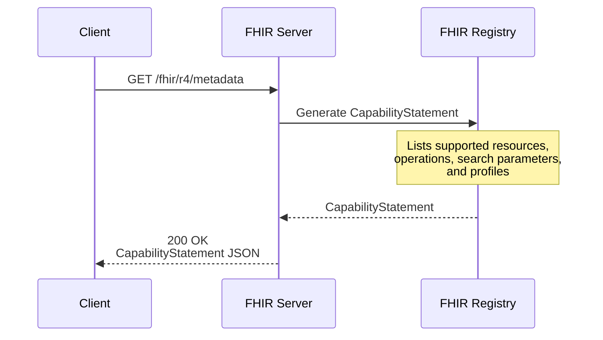
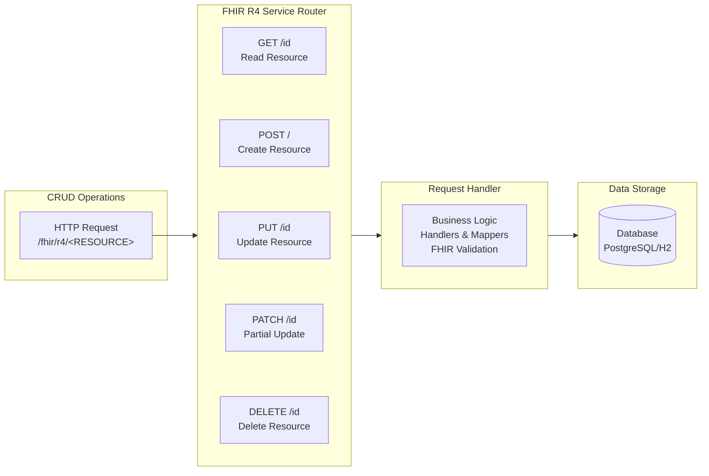
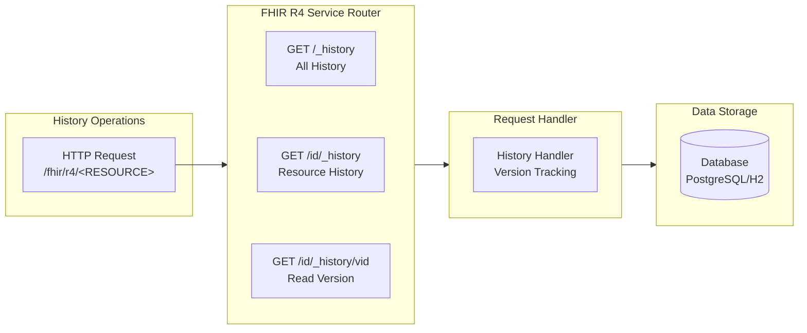
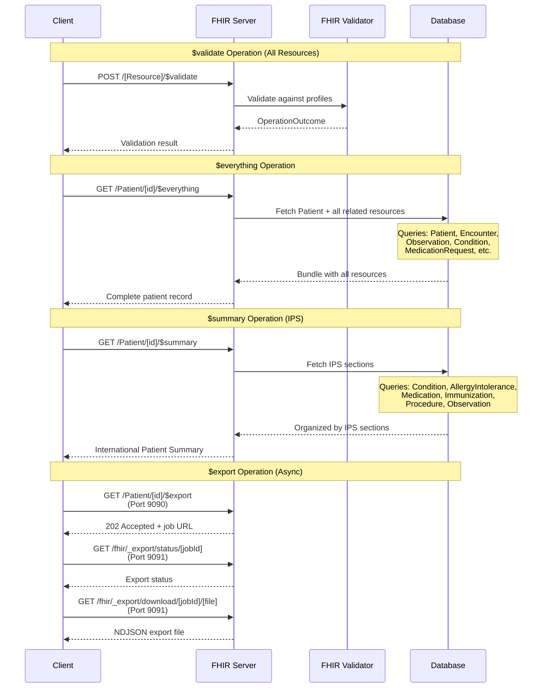

# FHIR Server

A comprehensive FHIR R4 server implementation built with Ballerina, featuring built-in H2 database support or Postgres.

## Features

### Core FHIR API Support
#### **1. Metadata request**: Endpoint to get server capability statement



#### **2. CRUD Operations**: Create, Read, Update, Delete for FHIR R4 resources



#### **3. History Tracking**: Resource version history with `_history` endpoint support



**History Version Management:**
- **What's Stored:** Complete resource snapshot (full JSON) is saved to `RESOURCE_HISTORY` table for every:
  - CREATE operation - Initial version
  - UPDATE operation - Before the update is applied
  - DELETE operation - Final version before deletion

#### **4. Search Capabilities**: Advanced search with query parameters

**Supported Search Parameters:**
- **Common Parameters:**
  - `_id` - Search by resource ID
  - `_lastUpdated` - Search by last modification date
  - `_profile` - Search by resource profile
  - `_count` - Limit number of results (pagination)
  
- **Include Parameters:**
  - `_include` - Include referenced resources in results (e.g., `_include=Patient:organization`)
  - `_include=*` - Include all referenced resources (wildcard)
  - `_revinclude` - Include resources that reference the search results (e.g., `_revinclude=Provenance:target`)
  - `_revinclude=*` - Include all resources that reference results (wildcard)

- **Resource-Specific Parameters:** Each resource type supports FHIR-defined search parameters (e.g., `name`, `identifier`, `status`, `date`, etc.) as defined in the FHIR R4 specification

**Example Search Queries:**
```
GET /fhir/r4/Patient?name=John&_count=10
GET /fhir/r4/Patient?_id=patient-123
GET /fhir/r4/MedicationRequest?patient=Patient/123&_include=MedicationRequest:medication
GET /fhir/r4/Patient?_id=123&_revinclude=Observation:subject
```

#### **5. FHIR Operations**



- **$validate** - Available for ALL resource types
  - Validates resource against FHIR R4 specification and custom profiles
  - Endpoint: `POST /fhir/r4/[ResourceType]/$validate`

- **$everything** - Available for:
  - **Patient** - Retrieves complete patient record including all related clinical data
  - **Encounter** - Retrieves encounter with all associated resources
  - **EpisodeOfCare** - Retrieves episode with all related resources
  - **Group** - Retrieves group members and related data
  - **Practitioner** - Retrieves practitioner with associated resources
  - Endpoint: `GET /fhir/r4/[ResourceType]/[id]/$everything`

- **$summary** (IPS) - Available for:
  - **Patient** only - Generates International Patient Summary
  - Includes: Problems, Allergies, Medications, Immunizations, Procedures, Results
  - Endpoint: `GET /fhir/r4/Patient/[id]/$summary`

- **$export** - Available for:
  - **Patient** - Bulk export of patient data in NDJSON format
  - Asynchronous operation with job tracking
  - Endpoint: `GET /fhir/r4/Patient/[id]/$export`
  - **Export File Management:**
    - Export files are created in `./data/exports/[jobId]/` directory
    - Each export job creates a separate directory with NDJSON files
    - **Important:** Export files are NOT automatically deleted
    - Consider implementing a scheduled cleanup job to remove old export directories
    - Recommended: Set up a cron job or scheduled task to periodically delete exports older than your retention policy (e.g., 24 hours, 7 days)


**Example Requests:**
```
POST /fhir/r4/Observation/$validate - Validate an Observation resource
GET /fhir/r4/Patient/123/$everything - Get complete patient record
GET /fhir/r4/Patient/123/$summary - Generate IPS for patient
GET /fhir/r4/Patient/123/$export - Export patient data
```

#### 6. **Custom Profiling**
- **StructureDefinition**: Create and manage custom FHIR profiles
- **Custom SearchParameters**: Define domain-specific search parameters
- **Resource Creation**: Validate resources against custom profiles

### Database Support
- **H2 Database**: Built-in embedded database (default configuration)
- **PostgreSQL**: Change configurations in Config.toml

## Quick Start

### Prerequisites

- [Ballerina](https://ballerina.io/downloads/) 2201.12.10 or later
- Java 21 or later
- H2 or Postgre 17 or later

### Starting the Server

**Unix/macOS/Linux:**
```bash
chmod +x start-server.sh
./start-server.sh
```

**Manual start:**
```bash
bal run
```

The server will start on `http://localhost:9090` with H2 database at `./data/fhir-db`.

## Testing with Postman

A complete Postman collection with sample FHIR API requests is available at:
```
scripts/postman-script/FHIR Server.postman_collection.json
```

Import this collection into Postman to quickly test all FHIR operations including CRUD, search, validation, and bulk export.

## Configuration

Edit `Config.toml` to customize the server. Below is the complete configuration template:

```toml
# JDBC Database Configuration for db_handler module
[ballerina_fhir_server.handlers]
# Database type: "h2" or "postgresql"
dbType = "h2"
# Database connection URL
# For H2: 
dbUrl = "jdbc:h2:./data/fhir-db"
dbUser = "sa"
dbPassword = ""
# For PostgreSQL:
# dbType = "postgresql"
# dbUrl = "jdbc:postgresql://localhost:5432/fhir_db"
# dbUser = "<dbUser>"
# dbPassword = "<dbPassword>"
# Set to true to clear all data and reinitialize the database on startup
# Set to false to keep existing data from previous runs
clearDataOnStartup = false

# Resource ID Generation Configuration
[ballerina_fhir_server.utils]
# Database type (MUST match handlers.dbType above)
dbType = "h2"
# If true, the server generates unique IDs for new resources (client-provided IDs are ignored)
# If false, the server uses the ID provided by the client in the resource JSON (if not provided, returns error)
useServerGeneratedIds = false

# Server Base URL Configuration for mappers module
[ballerina_fhir_server.mappers]
baseUrl = "http://localhost:9090"

# International Patient Summary (IPS) Configuration
[ips]
# Organization that maintains/custodian of the IPS documents
custodianOrganization = "Organization/default-hospital"
# Default author/practitioner for IPS documents
authorPractitioner = "Practitioner/system"
# Identifier system for IPS Bundle identifiers (OID or URI)
identifierSystem = "urn:oid:2.16.840.1.113883.2.4.6.3"
# IPS document title
documentTitle = "International Patient Summary"
```

### Key Configuration Options

**Database Type:**
- Both `[ballerina_fhir_server.handlers]` and `[ballerina_fhir_server.utils]` sections must have the **same** `dbType` value
- Supported values: `"h2"` (embedded) or `"postgresql"` (external)

**Database Connection:**
- **H2**: Auto-creates database at `./data/fhir-db` on first run
- **PostgreSQL**: Requires external PostgreSQL server running

**ID Generation:**
- `useServerGeneratedIds = true`: Server auto-generates resource IDs (ignores client-provided IDs)
- `useServerGeneratedIds = false`: Uses client-provided IDs (returns error if missing)

**Clear Data:**
- `clearDataOnStartup = true`: **WARNING** - Deletes all data and reinitializes schema on every server start
- `clearDataOnStartup = false`: Keeps existing data across restarts

## Database Management

### Clear Database on Startup
```toml
[ballerina_fhir_server.handlers]
clearDataOnStartup = true  # WARNING: Deletes all existing data
```

### Database Schema Initialization

**H2:** Database is created automatically.

**PostgreSQL:**
- Need to create a database (eg: fhir_db) in Posgres and execute the scripts/schema-postgresql.sql to create the tables.

## Switching Database

1. Edit `Config.toml` and change `dbType` in both sections
2. Update connection details
3. Restart server
