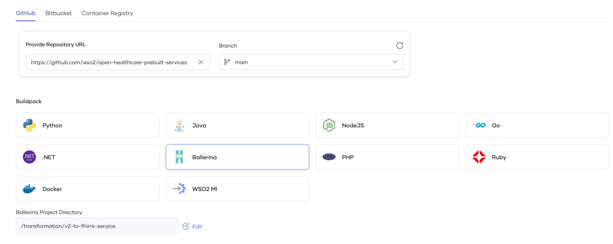

# HL7V2 to FHIR R4 Service

## Introduction

This service transforms HL7v2 messages to FHIR resources. Data transformation conditions are taken from the official HL7v2 to FHIR mappings page (https://build.fhir.org/ig/HL7/v2-to-fhir/) and based on the feedback received from the users.

You do not have to write code from scratch but reuse these existing services when implementing your FHIR services. You can deploy the pre-built service on your own environment or deploy on Choreo as a standard Ballerina service.

```Supported HL7v2 message versions are 2.3, 2.3.1, 2.4, 2.5, 2.5.1, 2.6, 2.7, 2.7.1, 2.8.```

```Supported FHIR version is 4.0.1.```

## Setup and run

1.Clone this repository to your local machine and navigate to the pre-built service on `v2-to-fhirr4-service`.

2. Run the project.

    ```ballerina
    bal run
    ```

4. Invoke the API.

    Sample request format:

    ```
    curl 'http://<host>:<port>/transform' \
    --data-raw 'MSH|^~\&|EPIC|EPICADT|SMS|SMSADT|202211031408|CHARRIS|ADT^A01|1817457|D|2.8'
    ```

## [Optional] Deploy in Choreo

WSO2’s Choreo (https://wso2.com/choreo/) is an internal developer platform that redefines how you create digital experiences. Choreo empowers you to seamlessly design, develop, deploy, and govern your cloud native applications, unlocking innovation while reducing time-to-market. You can deploy the healthcare prebuilt services in Choreo as explained below. 

### Prerequisites

If you are signing in to the Choreo Console for the first time, create an organization as follows:

1. Go to https://console.choreo.dev/, and sign in using your preferred method.
2. Enter a unique organization name. For example, Stark Industries.
3. Read and accept the privacy policy and terms of use.
4. Click Create.
This creates the organization and opens the Project Home page of the default project created for you.

### Steps to Deploy HL7 v2 to FHIR prebuilt service in Choreo
1. Create Service Component
    * Fork the pre-built Ballerina services repository (https://github.com/wso2/open-healthcare-prebuilt-services) to your Github organization.
    * Follow the official documentation to create and configure a service: https://wso2.com/choreo/docs/develop-components/develop-services/develop-a-ballerina-rest-api/#step-1-create-a-service-component. Use the following selections. 

        

    * Click Create. Once the component creation is complete, you will see the component overview page.

2. Build and Deploy
Follow the official documentation to deploy the HL7v2 to FHIR service to your organization https://wso2.com/choreo/docs/develop-components/develop-services/develop-a-ballerina-rest-api/#step-2-build-and-deploy.

